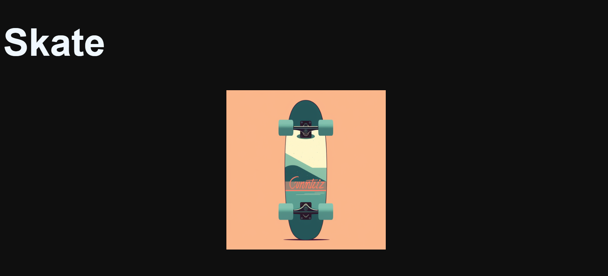

# Galeria-de-divs
Este código es un ejercicio de promesas y async/await para crear una animación que muestra y oculta diferentes divs con un tiempo de espera aleatorio.

 

        
 

 **Visitar sitio:** https://ferelias.github.io/Galeria-de-divs/
     
